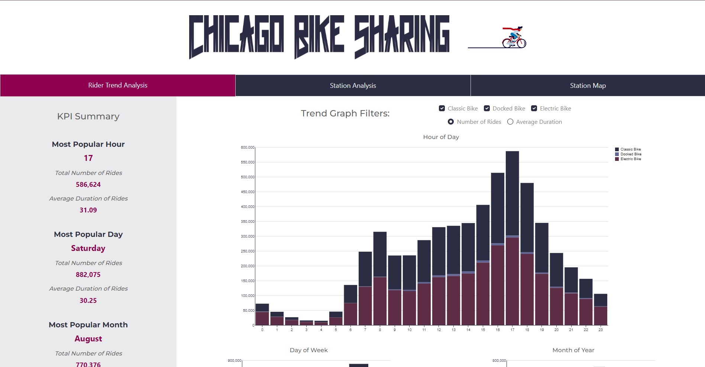
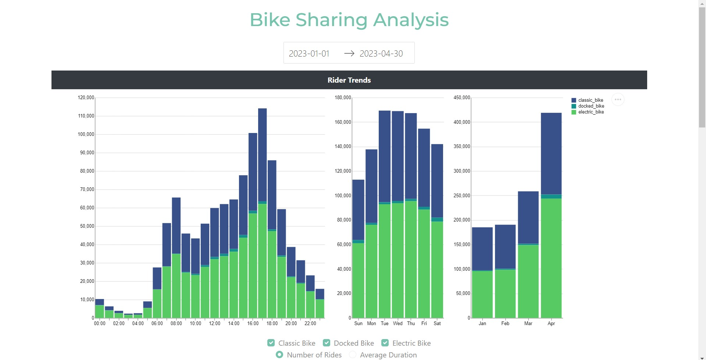
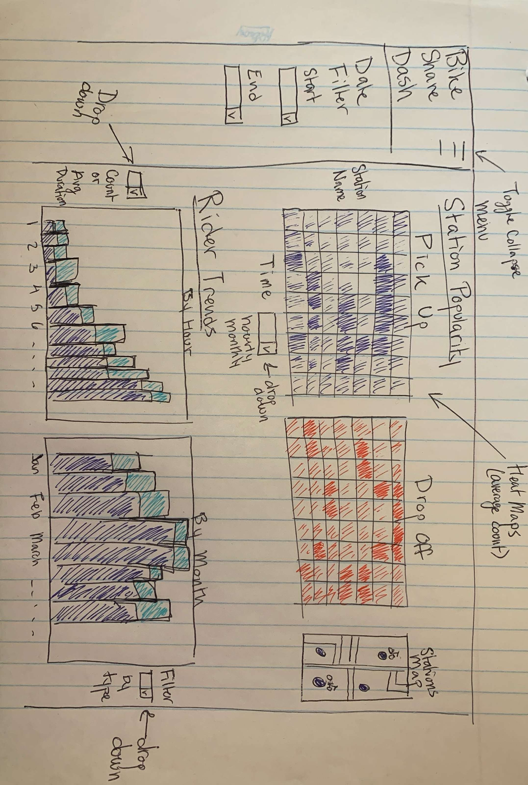

# Chicago Bike Sharing Dash App

[Bike Sharing App Link](https://bike-sharing-py-dashapp-44627a5faee5.herokuapp.com/)

The Bike Share Dashboard addresses the crucial challenge of maintaining an optimal bike inventory for profitability in bike-sharing businesses. Commissioned by a Bike Sharing Organization (e.g., NABSA), the dashboard aims to provide insightful visualizations on key aspects, answering vital questions for effective operational management.     

Motivation and Purpose:      
The primary objective of the dashboard is to visualize the most popular times for bike rentals, categorized by hour of the day and month. Understanding the duration of rentals based on bike type (classic/electric) and identifying popular rental locations are integral components. The dashboard is designed to ensure the Bike Sharing Organization can meet the demand adequately, enhancing operational efficiency.    

Research Questions:    
The dashboard addresses three critical research questions:     

1. **Peak Usage Times:** Identifying the most popular timeframes during the day and year for bike shares, anticipating commuting peaks and seasonal trends.    
2. **Duration Analysis:** Investigating the duration of trips based on ride type (electric/classic) to determine user preferences.     
3. **Station Popularity:** Analyzing the popularity of stations for both starting and ending bike shares, facilitating inventory management and relocation strategies to meet demand effectively.        

The Bike Sharing Dashboard serves as a valuable tool for the Bike Sharing Organization to make data-driven decisions, optimize inventory management, and enhance user experience in the dynamic and competitive bike-sharing industry. Finally, a sketch of the proposed dashboard can be seen in the image below. 

### Challenges
The biggest challenge faced with the project was dealing with 1 year's worth of data (more than 3 million rows). Some techniques used to reduce the memory load included pre-calculating metrics for plotting, multi-indexing, and storing data as parquet files for efficient storage. In addition, with Heroku deployment, storing files on GitHub in LFS format, and reading them directly helped speed up app deployment. However, ultimately, due to the sheer size, rather than using 1 years worth of data, a reduced amount of 4 months had to be used to stay under the Heroku 512mb memory limit to prevent the app from crashing.

As a permanent solution, the date selector was retired, and as a result, the entire data set could be used. We concluded that having access to the full amount of data was more important than having a "cool" date selector feature. In addition, the UI, graphics, and layout of the app were all changed in the imporved version - based on the peer review feedback and our own thoughts. Most importantly, a KPI Summary bar was added on the left to help highlight some of the key information from the plots on the right.
      

### App Outline    
The dashboard is broken into 3 tabs:
1. **Rider Trend Analysis**
2. **Station Analysis**
3. **Station Map**   
     
Each tab has a KPI summary section on the left which highlight key metrics from the visualizations.   
     
The Rider Trend Analysis tab contains 3 graphs, which show either number of rides started or average duration of ride, on an hourly, daily, and monthly basis. The number of rides are bar graphs plotted using altair and average duration are line graphs.   
    
The Station Analysis tab also contains 3 graphs. The first 2 are heatmaps comparing specific stations based on daily and hourly, while the third is a multi-station heatmap by hour. All 3 maps are subject to the same comparison metric chosen at the top from a series of radio buttons. The 3rd graph, contains a multi-select dropdown allowing for multiple stations to be selected, with the default being the top 4 stations. Order of stations in all dropdowns is in descending order by total number of rides. 
     
The Station Map tab shows a geographical plot with markings which indicate the bike stations. Based on the number of stations selected from the drop down at the top, ie. 50 chosen then the top 50 stations will be marked. The top and bottom stations will be marked with a different colored marker compared to the other stations.    
     

All colors and UI have been synced using HTML or CSS to give a better visual appeal - from the dropdown background, to graph plots, mouse hovers, text colors, etc.    

### Improved Dash App    
    
   

### Dash App Version 1    
     
    
       
### Initial App Sketch     
        

